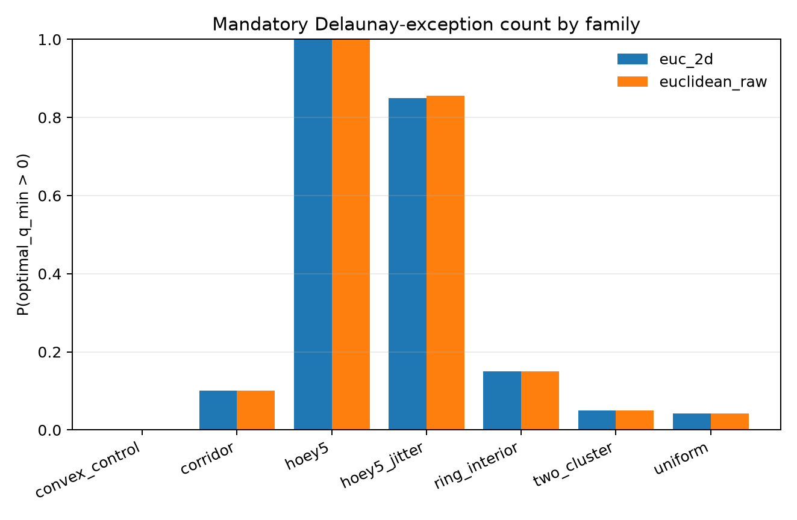
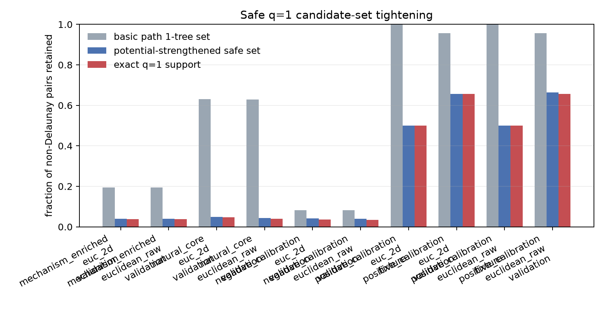
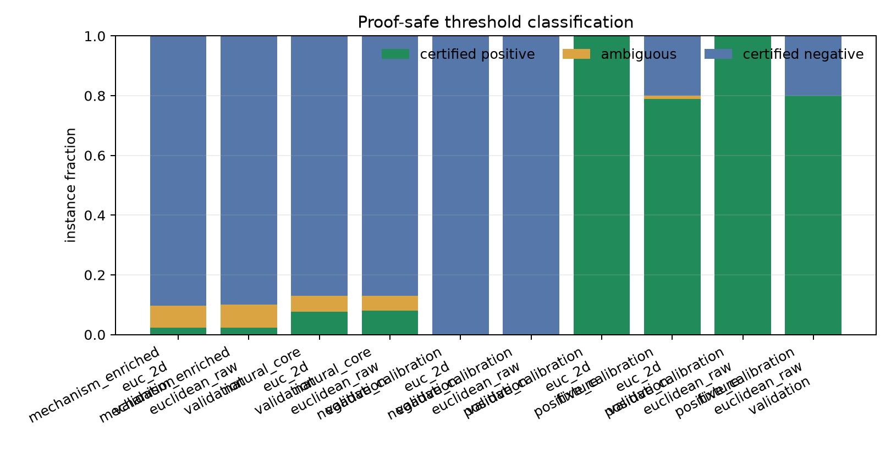

# 테스트 결과와 해석

## 1. 결론 요약

이번 연구의 핵심 성과는 “예외간선을 전부 맞혔다”가 아니다.
예외간선을 기준 후보그래프에 상대적인 \(q\)-closure 문제로 바꾸고,
그 첫 층 \(q=1\)을 exact 항등식과 안전한 계산구간으로 다룬 것이다.

exact-small에서는 관찰된 mandatory Delaunay 예외가 거의 모두
\(q=1\) closure로 설명되었다. LIN318에서는 exact \(\kappa\) 대신
검증 가능한 safe lower bound를 사용해 512개 중 13개 구조적
양성을 찾았고, LKH closure와 2/3-opt를 결합한 탐색이 기존
42,210 basin을 42,108까지 낮췄다.

이것은 구조적 메커니즘의 유력한 증거이지만, 완전성이나 독립 solver
성능의 증거는 아니다.

### 1.1 선행 탐색 단계의 음성 결과

Stage 2·3에 앞서 50–150정점 TSPLIB strict-core 10을 대상으로
reference-only CUT 파일럿을 수행했다. 하나씩 검증된 공식 최적투어에서
Delaunay 밖 reference edge는 11개였고, outcome-blind 일반 기하 CUT은
그중 2개를 reference two-crossing interface에 귀속했다
(pooled 2/11=18.2%, instance-macro 21.4%). 280개 제안 CUT 중 reference
tour가 실제로 두 번 교차한 비율은 55.4%였지만, 모든 최적투어의
two-crossing을 독립 인증한 CUT은 0개였고 9개 edge가 미귀속으로 남았다.
이 수치는 forced-edge recall이 아니라 하나의 reference tour에 대한
구조 귀속률이다.

후속 Stage 1B에서는 density hierarchy가 제안한 CUT 92개 중 42개가
reference tour를 두 번 교차했지만, exact cross-\(k\) persistence와
현재 two-crossing 충분인증은 각각 0개였다. 더 중요하게는 전체 11개
Delaunay reference exception과 Stage 1 잔여 9개 모두에서 blind
candidate contact, density-CUT 귀속, portal-edge 선택, pair 회수가
각각 0개였다. 따라서 density-CUT은 일반적인 tour-contiguous backbone
후보에는 신호가 있었지만 당시 예외간선 생성기로는 실패했다.

이 두 단계는 후속 closure 이론으로 이동하게 만든 중요한 음성 증거다.
현재 compact release에는 그 요약만 보존하며, raw artifact와 study
driver는 포함하지 않는다. 이후 Stage 2·3의 \(q\)-closure 결과는 이
실패를 숨긴 대체 수치가 아니라, 질문을 CUT 발견률에서 Hamiltonian
closure 구조로 다시 정의한 별도 단계다.

## 2. Stage 2 — closure spectrum

동결된 541개 좌표 인스턴스를 raw Euclidean과 `EUC_2D`로 분석했다.
raw 결과의 핵심은 다음과 같다.

| 표본 | mandatory exception | 비율 |
|---|---:|---:|
| 비표적 합성 family 360개 | 23 | 6.39% |
| structured mixture 120개 | 9 | 7.50% |
| uniform 120개 | 5 | 4.17% |
| ring-interior 60개 | 9 | 15.00% |
| strict-convex 60개 | 0 | 0% |

전체 raw mandatory 178건 중 177건, 즉 99.44%가 \(q=1\)에서
최적값에 도달했다. 한 corridor 사례는 \(q=2\)가 필요했다.

### 해석

이 결과는 비-Delaunay 예외가 무작위로 흩어진 긴 간선이라기보다,
대부분 “Delaunay Hamiltonian path 하나를 비기준 간선 하나로
닫는 상태”로 나타났음을 뜻한다.

다만 178건에는 이 현상을 의도적으로 포함한 Hoey 계열이 들어간다.
6.39%를 일반 Euclidean TSP의 발생률로 외삽하지 않는다.
structured와 uniform의 차이도 사전 통계 기준을 통과하지 못했다.

## 3. Stage 3 — exact threshold와 안전 인증

### 3.1 natural core

uniform 300개와 structured mixture 300개를 합친 natural core의 raw
결과다.

| 지표 | 결과 |
|---|---:|
| mandatory 인스턴스 | 51/600 |
| exact global \(q=1\) | 51/51 |
| exact exclusive \(q=1\) | 51/51 |
| 현재 bound로 안전 인증 | 48/51 = 94.1% |
| exact beneficial pair | 98 |
| 안전 양성 pair | 88/98 = 89.8% |

51/51은 이 동결 표본에서의 exact 설명 상한이다. 48/51과 88/98은
현재 1-tree·feasible witness 부등식만으로 증명한 coverage다. 둘을
“89.8% 정확도” 하나로 합치지 않는다.

### 3.2 support-preserving 후보 축소

| 항목 | 수 |
|---|---:|
| natural core 전체 비-Delaunay pair | 15,054 |
| 안전 후보 상한 \(\mathcal A\) | 644 |
| 제거율 | 95.7% |
| exact \(q=1\) support | 600 |
| 보존된 exact support | 600/600 |

이것은 각 exact-small 인스턴스의 pair pool을 합친 감사다.
인스턴스당 평균 1.07개라는 표현은 여기서 유래하지만, 대규모에서
항상 \(O(1)\) 후보가 된다는 복잡도 정리는 아니다.

### 3.3 ring 표본이 보여주는 증명력의 한계

ring-interior 300개에서 mandatory 26건 모두 exact \(q=1\)이었지만,
안전 인증은 7/26에 그쳤다. 메커니즘이 틀린 것이 아니라 cycle
1-tree 하한의 duality gap이 실제 gain보다 큰 경우가 많았다.

따라서 낮은 인증률은 현상의 부재와 현재 relaxation의 약함을
구분해야 한다.

## 4. LIN318 — 후보영역과 기준값

### 4.1 후보영역

| 항목 | 값 |
|---|---:|
| 완전그래프 | 50,403 edges |
| weak-Delaunay | 988 |
| 추가 후보 | 512 |
| 최종 후보그래프 | 1,500 |
| 완전그래프 대비 | 2.976% |

이 1,500개는 임계점 이론이 직접 만든 것이 아니다. 별도 후보 생성
결과를 임계점으로 후속 screening했다.

### 4.2 weak-Delaunay 제한 exact 값

SEC-MILP의 유효한 integer lower bound와 독립 검증된 feasible upper
bound가 모두

\[
Z_0=42{,}231
\]

에서 일치했다. 공개 폴더의
`results/lin318/restricted_baseline/`에 round 기록, audit JSON,
tour witness를 보존했다.

### 4.3 zero-base pilot의 실패

Colab pilot의 15개 조건은 각 60초 안에 Hamiltonian cycle을 찾지
못해 모두 `no_cycle_found`였다. 이 pilot 자체를 성공한 독립 solver
실험으로 해석하지 않는다.

후속 분석은 봉인된 2-factor를 결정론적으로 patch하고 strict
candidate-only 2/3-opt를 적용해

\[
T_0=42{,}210
\]

을 재구성했다.

## 5. LIN318 — 512개 forced closure 스캔

각 추가 후보 \(e\)에 대해 LKH가 `weak-Delaunay + e` 안의 forced
cycle을 만들었고, 별도 verifier가 다음을 전수 확인했다.

- 318정점 Hamiltonicity
- \(e\) 포함
- 나머지 317개 간선의 weak-Delaunay 소속
- `EUC_2D` 비용 재계산
- \(H_{\rm upper}+c(e)=C_{\rm upper}\)

512/512 witness가 검증을 통과했고, 불일치는 0건이었다.

\[
\underline G_e
=42{,}231-\overline H_e-c(e)>0
\]

인 안전 양성은 13개였다.

| 구분 | 수 | 의미 |
|---|---:|---|
| 안전 양성 | 13 | 해당 pair의 어떤 \(q=1\) closure가 기준 42,231보다 짧음 |
| 비양성 하한 | 499 | 현재 feasible witness로 양성을 증명하지 못함 |
| exact \(\kappa\) 계산 | 0 | 대규모 exact endpoint path는 풀지 않음 |

13/512=2.54%는 recall이 아니다. 499개는 음성도 아니다.

## 6. LIN318 — basin 탈출

### 6.1 직접 단일간선 kick

\(T_0\)에 이미 있던 안전 양성 3개를 제외한 10개를 각각 atomic하게
삽입했다. lock 아래서는 유지되었지만, lock을 풀고 strict 2/3-opt를
재실행하면 모두 42,210으로 돌아왔다.

이는 \(\kappa>1\)이 “현재 tour에서 작은 한 번의 kick이면 개선된다”는
명제가 아님을 보여준다.

### 6.2 closure seed

각 안전 양성의 검증된 forced-closure tour를 1,500-edge 2/3-opt의
시드로 사용했다. 최선은 edge `(88,98)`의 closure에서 나온

\[
42{,}118
\]

이었다. \(T_0\)보다 92 짧다.

### 6.3 두 번째 개입

42,118 상태에서 안전 양성 `(27,102)`를 atomic genuine 3-opt로
삽입하고 lock/release 하강을 수행해

\[
42{,}108
\]

에 도달했다. \(T_0\)보다 102 짧다.

### 6.4 미확정 top-32 probe

42,108에 남아 있던 안전 양성 5개를 anchor로 잠그고, 초기
비양성·미확정 row 중 closure upper가 좋은 32개를 각각 개입했다.
42,108보다 나아진 결과는 없었다.

## 7. 알려진 최적값과 사후 비교

| 상태 | 비용 | 42,029 대비 |
|---|---:|---:|
| weak-Delaunay 제한 optimum | 42,231 | +202 |
| strict 1,500-edge \(T_0\) | 42,210 | +181 |
| best closure seed | 42,118 | +89 |
| 두 번째 안전 개입 | 42,108 | +79 |
| 알려진 optimum | 42,029 | 0 |

최종 잔여는

\[
\frac{42{,}108-42{,}029}{42{,}029}
=0.18797\%.
\]

알려진 최적값은 선택에 사용하지 않고 사후 비교에만 썼다.

## 8. 종합 해석

### 강하게 말할 수 있는 것

1. exact-small 표본에서 mandatory Delaunay exception은 매우 강하게
   \(q=1\) closure에 집중됐다.
2. \(\kappa=1\)은 그 현상을 정확히 표현하는 대수적 경계다.
3. 현재 1-tree 구간은 natural core의 상당 부분을 거짓 양성 없이
   인증하고 exact support를 크게 줄였다.
4. LIN318에서도 적어도 13개 q=1 개선 closure의 존재를 안전하게
   증명했다.
5. 그 closure가 제공한 전역 경로배치는 단순 2/3-opt의 42,210
   basin과 다른 더 좋은 basin으로 실제 이동시켰다.

### 아직 열려 있는 것

1. 512개 전체의 exact \(\kappa\) 분포와 recall
2. 다른 대형 인스턴스에서의 재현성
3. 동일 예산 대조군 대비 threshold ranking의 우위
4. 42,108과 optimum 사이 79의 원인
5. 여러 portal과 companion edge의 bundle 호환성
6. LKH 없이 closure 구조를 직접 구성하는 scalable predictor

따라서 현재 가장 적절한 연구적 평가는 다음과 같다.

> 예외간선은 완전히 무작위인 잔차로 보이지 않는다. 적어도
> \(q=1\) 층에는 endpoint Hamiltonian path를 비기준 간선으로 닫는
> 정확한 구조가 있고, 이 구조는 작은 문제에서 매우 높은 설명력을,
> LIN318에서 안전한 존재 증명과 실제 basin 이동을 보였다. 그러나
> 완전한 예외 분류와 독립 solver로 가려면 higher-order bundle과
> 사전 predictor를 아직 해결해야 한다.
